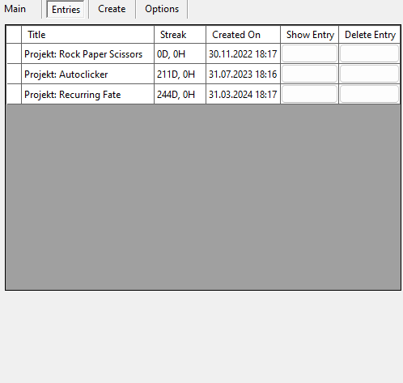
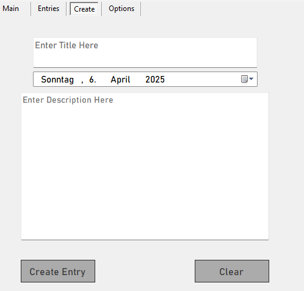

# Recurring Fate

Die Windows Desktop Anwendung "Recurring Fate" dient dazu, Einträge zu verfassen und die Zeitabstände der vorhandenen Einträge einzusehen.



Diese Einträge werden in einer Liste behalten und werden in einer Übersicht dargestellt. In dieser Übersicht kann man die Zeitabstände der Einträge einsehen.




Jeder Eintrag benötigt folgene Daten:
- Titel
- Beschreibung
- Datum

In den Einstellungen, kann man die erstellten Einträge in einer JSON Datei abspeichern und sie wieder laden. Erstellte Einträge kann man auch bearbeiten oder löschen über den "Entry" Tab.

---

## 🛠️ Technologien

- **Sprache:** C#
- **Framework:** .NET 4.7.2 (oder höher)
- **Entwicklungsumgebung:** Visual Studio
- **Weitere Tools:** [Newtonsoft Json von JamesNK](https://github.com/JamesNK/Newtonsoft.Json)
---

## 🚀 Funktionen

- Erstellung von Einträgen
- Bearbeitung von vorhandenen Einträgen
- Datenspeicherung zu einer JSON-Datei
- Laden von validen JSON Dateien, um vorhandene Einträge zu laden

- Löschen von Einträgen

---

## 🔧 Installation & Ausführung

### Schritte

1. Repository klonen:
   ```bash
   git clone https://github.com/PPahl04/RecurringFate.git
   cd "Recurring Fate"

2. Anwendung starten
    ```bash
    dotnet build
    "Recurring Fate\bin\Debug\net8.0-windows\Recurring Fate.exe"
